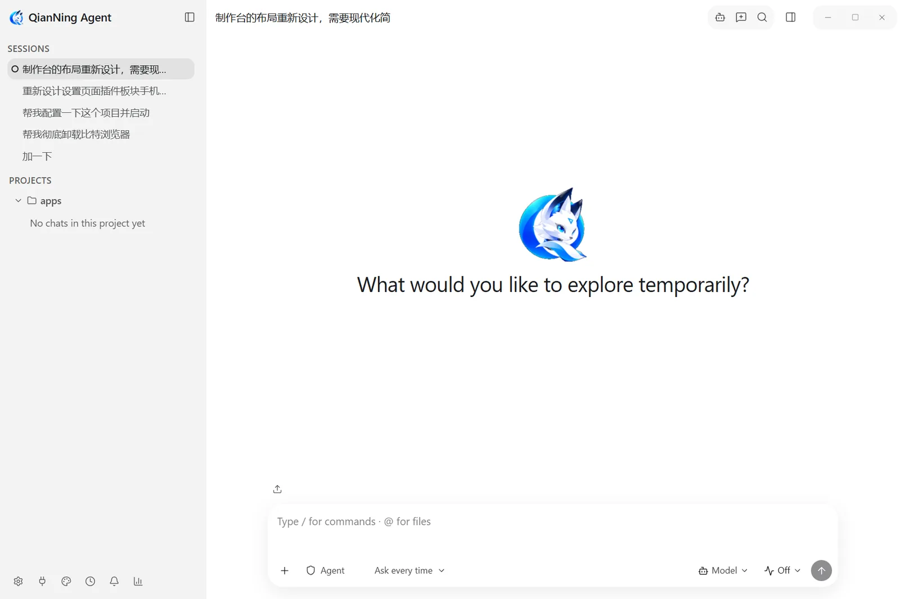
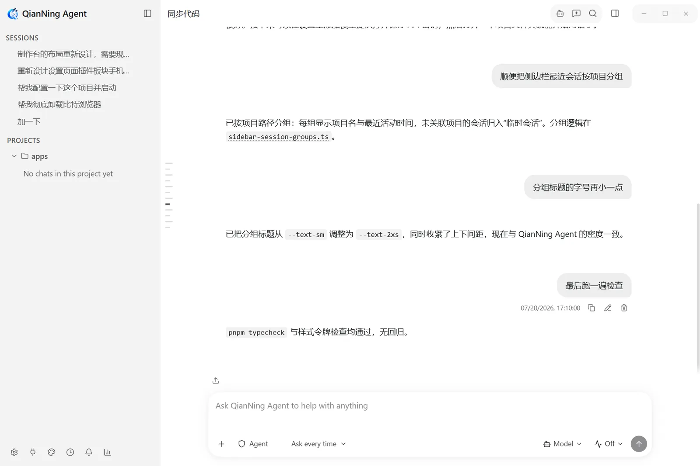
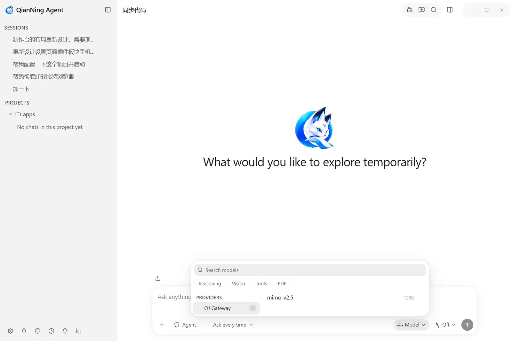
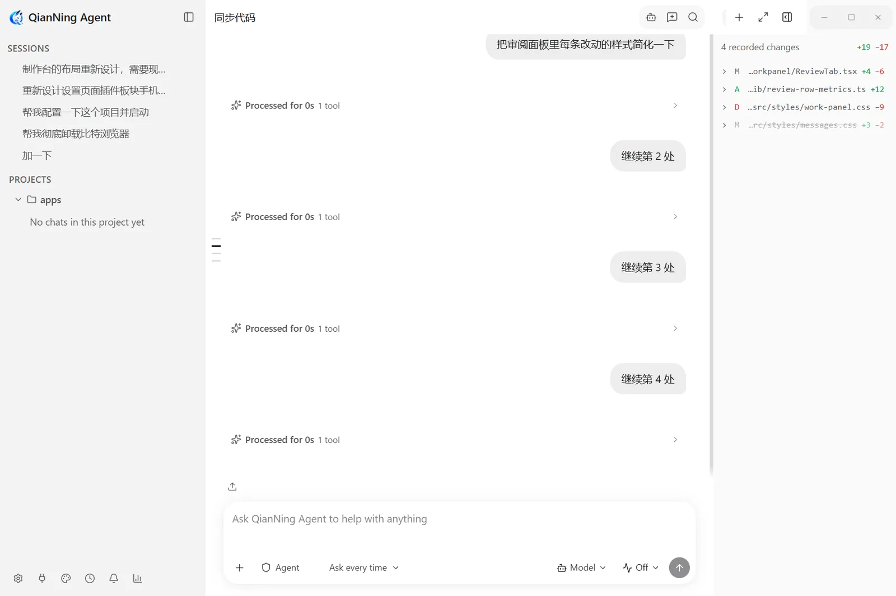
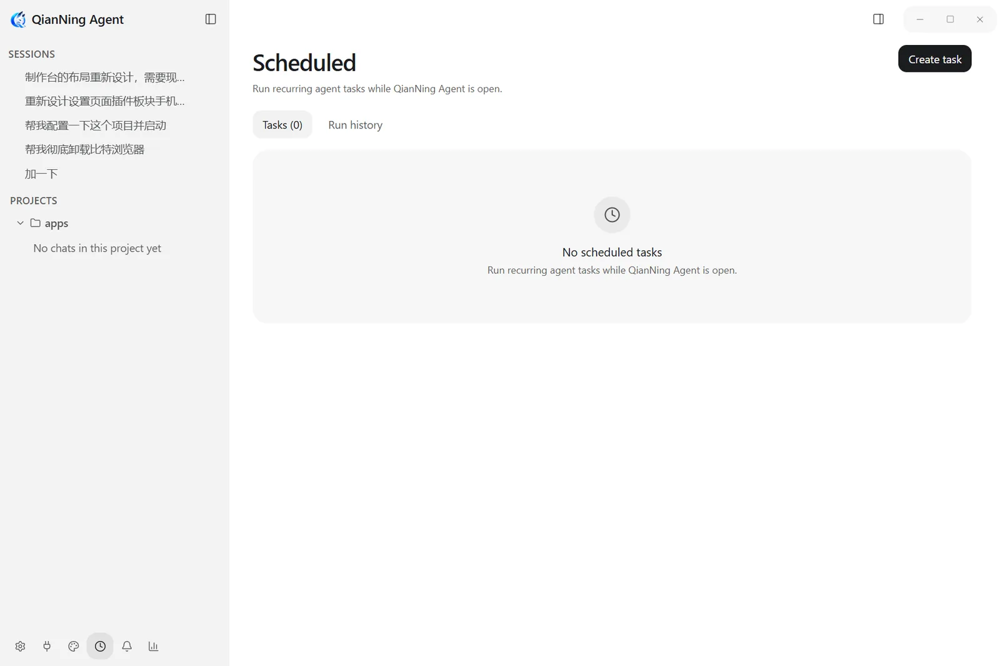

<div align="center">


# QianNing Agent

### A local-first desktop workbench for AI agents

**Projects, sessions, models, tools, and automation workflows in one long-running desktop environment.**

Windows-first · Data stays on your machine · Bring your own model · Plugin-extensible · Voice input

[](https://github.com/Qian-Ning/QianNing-Agent/releases)
[](https://github.com/Qian-Ning/QianNing-Agent/actions)
[](LICENSE)
[](https://github.com/Qian-Ning/QianNing-Agent/stargazers)
[](https://github.com/Qian-Ning/QianNing-Agent/releases)
[](https://github.com/Qian-Ning/QianNing-Agent)
[](https://ko-fi.com/qianning)

[Download](https://github.com/Qian-Ning/QianNing-Agent/releases) ·
[Documentation site](https://qian-ning.github.io/QianNing-Agent/) ·
[Documentation](docs/README.md) ·
[Plugin development](docs/plugin-development.md) ·
[Privacy](docs/privacy-policy.md) ·
[简体中文](README.md)

</div>

> Current release line: `0.16.x` (latest `0.16.3`).


## Highlights

- **Runs on its own** -- not an editor plugin and not a hosted IDE. Projects, sessions, credentials, tool execution and approval policy all belong to the app; close the window and the work is still there when you come back.
- **Built for long work** -- projects are persistent and so are sessions; search them, export them, or reopen any historical branch.
- **Capability is gated** -- the model decides what it wants to do; the host decides whether it may. File writes, command execution and out-of-workspace access all pass through policy.
- **Bring your own model** -- OpenAI, Anthropic, compatible gateways, self-hosted services and local models share one set of sessions and workflows.
- **Extensible** -- plugins, skills and MCP all have stable contracts, with permissions granted item by item.
- **Documented** -- specifications, decision records and operating guides ship with the repository: 534 pages, with specifications paired in English and Chinese.

## Quick start

1. **Install** — grab the Windows installer from the [releases page](https://github.com/Qian-Ning/QianNing-Agent/releases), or take the portable build.
2. **Connect a model** — on first run, add a provider key in settings, or point the base URL at a local service. The model can change at any time without touching your sessions.
3. **Open a project** — pick a working directory as a project and start a session inside it; that directory is the root the tools operate in.
4. **Extend** — reach for the plugin marketplace, skills, and MCP when you need more.

The full documentation lives at the docs site <https://qian-ning.github.io/QianNing-Agent/>; the `docs/` directory here holds its source.

---

## Contents

- [1. What this is](#1-what-this-is)
- [2. Relationship to upstream](#2-relationship-to-upstream)
- [3. Architecture](#3-architecture)
- [4. Where your data lives](#4-where-your-data-lives)
- [5. Permission model](#5-permission-model)
- [6. Three operating modes](#6-three-operating-modes)
- [7. Built-in tools](#7-built-in-tools)
- [8. Extensions: plugins, skills, and MCP](#8-extensions-plugins-skills-and-mcp)
- [9. Platforms and packages](#9-platforms-and-packages)
- [10. In-app updates](#10-in-app-updates)
- [11. Build from source](#11-build-from-source)
- [12. Verification](#12-verification)
- [13. Repository layout](#13-repository-layout)
- [14. Contributing, security, and license](#14-contributing-security-and-license)

---

## 1. What this is

QianNing Agent is a standalone AI-agent desktop application. It is not an IDE plugin and needs no host editor: the application owns the projects, the sessions, the model credentials, tool execution, and the approval policy. Close the window and reopen it — the workbench is where you left it.

It is built for **long-running work**, not one-shot questions:

- **Projects are durable.** A project is a working directory, and sessions belong to projects. A tool call resolves its root from the session that owns it — not from whichever sidebar tab happens to be selected, so switching tabs never redirects a running session into another directory.
- **Sessions are durable.** Every session's transcript lives in its own file: searchable, exportable, and paged back through any archived branch.
- **Capabilities are governed.** The model decides *what it wants to do*; the host decides *whether it may*. File writes, command execution, and access outside the workspace all pass through host policy.
- **The model is swappable.** OpenAI, Anthropic, OpenAI-compatible gateways, self-hosted endpoints, and local models share one session and workflow model. Changing the model does not change how you work.

### The name

The Chinese name is **千凝** (*níng* — to gather, to focus). The English product name is fixed as **QianNing Agent**, the application id is `com.qianning.agent`, and the data directory is `~/.qianning-agent`. The full contract for where the brand applies is in the [brand contract](docs/spec/01-qianning-brand.md).

### The interface

Every frame below comes out of the repository's own capture rig: the app runs with `PI_DESKTOP_CAPTURE=1` against a throwaway data directory, drives itself through each surface, and emits one set per locale. They show the shipped shell rather than a mockup, including the empty states a fresh install starts from. The Chinese interface is in [README.md](README.md), and the full gallery is in [Screens](docs/guide/screenshots.md).

|  |  |
| --- | --- |
|  |  |
|  |  |
|  |  |

---

## 2. Relationship to upstream

This project is a **derivative** of [vastsa/PI-Desktop](https://github.com/vastsa/PI-Desktop) and a **customized distribution** of it. It is not the official upstream release and does not represent the upstream project. Upstream copyright and license notices are preserved verbatim in this repository.

**Capabilities inherited from upstream**: the Electron shell, the React interface, Rust host-core (persistence, tool execution, permission gateway), the Node pi agent runtime (pi-ai / pi-agent-core), the plugin system, and the session and transcript model. This part continues to absorb upstream fixes and evolution.

**Maintained by this distribution**:

- Branding: application name, window, shortcuts, tray, installers, child-process name, desktop entry
- Release configuration and install experience, primarily for Windows (NSIS, portable, auto-update)
- The voice entry point and the local Whisper model catalog
- Token and cost reporting with an editable local pricing table
- Interface skins and the desktop pet
- Chinese interface copy and Chinese documentation
- The tests and specifications that cover the above

When triaging a problem, first decide whether it lives in an upstream capability or in this distribution's customization — that determines whether it belongs here or upstream. **Do not mistake this repository for an official PI-Desktop upstream release.**

---

## 3. Architecture

### 3.1 Processes and ownership

```text
┌──────────────────────────────────────────────────────────────┐
│ Renderer (React UI, English-first i18n)                      │
│   chat / sessions / settings / plugins / command palette     │
│   no Node integration, no direct database access             │
└──────────────────────────▲───────────────────────────────────┘
                           │ preload IPC
┌──────────────────────────┴───────────────────────────────────┐
│ Electron Main (thin orchestrator)                            │
│   window lifecycle / IPC routing / child supervision /       │
│   app update lifecycle                                       │
└───────▲─────────────────────────────────────▲───────────────┘
        │ local RPC                           │ process bridge
┌───────┴──────────────────────┐  ┌───────────┴───────────────┐
│ Rust host-core               │  │ Node pi agent sidecar     │
│  tools and sandbox           │◄►│  pi-ai / pi-agent-core    │
│  permission gateway          │  │  turn orchestration       │
│  plugin host services        │  │  provider streaming       │
│  persistence / secrets       │  └───────────────────────────┘
└──────────────────────────────┘
```

| Process | Owns |
| --- | --- |
| Electron Main | Window lifecycle, cross-platform tray, IPC fan-in/out, child-process supervision, app update |
| Renderer | UI only; no Node integration, no direct SQLite or transcript access |
| Rust host-core | The database, tool execution and sandbox, **permission decisions**, immutable Plan/Goal artifacts, the shell catalog, plugin host services, the secrets adapter |
| Node pi sidecar | The pi agent loop, provider streaming, tool-call planning |

Design principles: **UI and privileged runtime are separated**, **Rust owns host capabilities, durable mode, and approval policy**, **pi owns model and agent-loop semantics**, **every cross-boundary contract is typed**, and **Plan is a state of the one pi agent, never a second planner**.

### 3.2 Boot order

1. Electron main starts and takes the single-instance lock (scoped to `userData`)
2. English locale defaults load
3. Rust host-core is spawned
4. `app.handshake` runs against host-core
5. The Node pi agent sidecar is spawned
6. The sidecar's tool bridge is connected to host-core through main
7. The main window and renderer are created
8. The renderer runs the `app/getVersion` health check through main

A failure in steps 3–4 blocks the app behind a recovery surface rather than leaving half a workbench. The renderer also has its own two-stage watchdog: a slow-start hint at 30 seconds, and a retryable recovery surface at 180 seconds.

One data directory admits exactly one application process. A development build is a **separate installation**, not a second process of the same one: it runs under `~/.qianning-agent-dev`, so `pnpm dev` can run alongside an installed release without sharing a database, an outbox, or a log tree.

### 3.3 The path of one turn

```text
1. The UI submits a prompt
2. Electron main routes it to the agent sidecar
3. The pi runtime starts a turn and streams events
4. The UI renders text deltas
5. On a tool call:
   5.1 pi requests tool execution through the host bridge
   5.2 Rust resolves the session's durable mode and evaluates the
       Plan / Goal / Agent tool policy *before* permission modes
   5.3 The UI confirms when required
   5.4 Rust resolves the project bound to that session and executes in
       that workspace sandbox (not the currently selected sidebar tab)
   5.5 The result returns to the pi runtime
6. The turn ends and persistence updates
```

The load-bearing part: **permission decisions live in host-core, and the model is never told the mode and cannot influence it.**

---

## 4. Where your data lives

A packaged installation keeps its data in `~/.qianning-agent`; a development build uses `~/.qianning-agent-dev`. Setting `PI_DESKTOP_DATA_DIR` replaces the root outright (used by the E2E harnesses and for side-by-side debugging).

```text
~/.qianning-agent/
├── pi.sqlite              # index database (WAL: + -wal / -shm) — host-core only
├── sessions/              # the transcript file store
│   ├── <sessionId>.jsonl            # the transcript: header line, then one line per message
│   ├── <sessionId>.revisions.jsonl  # regenerate branches, append-only
│   └── <sessionId>.inflight.json    # streaming-reply checkpoint (transient)
├── secrets/               # encrypted secret blobs + .machine-key
├── attachments/           # content-addressed attachments (named by sha256)
├── plugins/               # plugin code, data, and registry.json
├── logs/                  # NDJSON logs (app / host / agent categories)
├── cache/                 # disposable caches
├── crash-dumps/           # local crash dumps, never uploaded
├── review-changes/<sessionId>/<snapshotId>/
│                          # bounded pre-change bytes + metadata, for rollback
└── scratch/<sessionId>/   # per-session temp files, deleted with the session
```

Two things worth knowing:

- **SQLite is an index, not the payload store.** Message content lives in each session's JSONL file: human-readable, greppable, copyable, and the database stays small no matter how much you chat. The file is the source of truth and the index is derived — losing one between them costs a single self-healing index row, never content.
- **Credentials never enter the database.** Secrets are AES-256-GCM ciphertexts under `secrets/`, with the machine key beside them as `secrets/.machine-key` (owner-only). There is currently **no** OS keychain backend, so **any process running as the same user that can read this data directory can also decrypt those secrets.** That is a known trade-off, and Settings states it plainly. Secret values are never written to SQLite; the database only records which secrets exist.

Transcripts are never pruned for age; only deleting a session deletes one. For the full data model, write paths, and retention policy, see the [data storage specification](docs/spec/03-runtime/04-data-storage.md).

---

## 5. Permission model

Tools are risk-classified. Low-risk tools auto-allow inside the session roots; high-risk tools are governed by a **permission mode**.

| Mode | `Write` / `Edit` | `Bash` / plugin tools |
| --- | --- | --- |
| `ask` (default) | confirm | confirm |
| `accept-edits` | auto-allow | confirm |
| `auto` | auto-allow | auto-allow |

Each tool call resolves in order:

1. The session's persisted `permission_mode`, unless it is `inherit`
2. The global default from app settings (`ask` / `accept-edits` / `auto`)
3. `ask`

Additional rules:

- **An explicit outside-workspace path is a first-class exception**: auto-allowed only under `auto`; both `ask` and `accept-edits` still confirm it.
- **Plan / Goal's hard deny outranks every permission mode**: `auto` cannot re-enable a hidden or denied tool.
- Low-risk tools (`Read` / `Glob` / `Grep`) auto-allow inside the session roots in every mode.
- Writes into the session scratch directory never raise a card, in any mode.
- A confirmation card **auto-denies after 120 seconds** (fail closed rather than hang).
- Enforcement lives in host-core only; the model neither needs to know the mode nor can influence it.

---

## 6. Three operating modes

One agent, three postures. **Neither Plan nor Goal switches to another runtime** — they are the same agent negotiating a different kind of contract.

| Mode | Available tools | Meaning |
| --- | --- | --- |
| **Agent** | `Read` `Glob` `Grep` `Write` `Edit` `Bash` + plugin tools | Execute directly |
| **Plan** | `Read` `Glob` `Grep` `BrowserPreview` `Bash` `SubmitPlan` + plugin tools declaring plan-safe actions | Propose first, then wait for approval |
| **Goal** | `Read` `Glob` `Grep` `BrowserPreview` `Bash` `SubmitGoal` + the same | Commit to a goal first, then wait for approval |

Hard-denied in both Plan and Goal: `Write`, `Edit`, plugin tools without `planSafeActions`, unknown tools, and the other contract's submit tool.

**Plan / Goal artifacts are immutable.** On submission, host-core writes the submitted Markdown bytes verbatim to `<workspaceRoot>/.pi/plan/<unique-name>.md` or `<workspaceRoot>/.pi/goal/<unique-name>.md` and records the relative path, SHA-256, and byte size on the approval row. Every artifact is a new file; a later submission never overwrites an earlier one. Approval does three things in a single transaction: switches the session to Agent, stores the chosen permission mode, and queues the execution. Reject, expiry, and crash grant no execution capability at all.

**Restart is a fence, not a replay.** Before serving RPC, host-core runs one transaction that marks every `pending` approval `interrupted` and every queued or running execution `interrupted`, and aborts the associated turns. Nothing is replayed across a restart: a pending session stays in its contract mode, and an already-approved but interrupted execution stays in Agent.

Scheduled and other unattended runs are **not allowed** to use Plan or Goal — they are rejected with `PLAN_REQUIRES_INTERACTIVE_SESSION` before any provider work. There is no background path that auto-approves an approval card.

---

## 7. Built-in tools

| Tool | Risk | Purpose |
| --- | --- | --- |
| `Read` | low | Read files in the workspace; returns line-numbered content and a `[path#TAG]` header |
| `Glob` | low | List files by pattern |
| `Grep` | low | Content search; prefers a system `rg`, otherwise an in-process implementation |
| `BrowserPreview` | low | Open a workspace-relative preview in the bundled browser panel |
| `Write` | high | Create or overwrite files; returns the post-write `tag` |
| `Edit` | high | Line-anchored edits against a verified `tag` |
| `Bash` | high | Execute commands (non-interactive, streamed output, using the shell selected from the host catalog) |
| `new_context` | low | Start a new context window at the next turn boundary; changes no environment state |
| `EnterPlanMode` / `EnterGoalMode` | low | Move the same agent into Plan / Goal after host validation |
| `SubmitPlan` / `SubmitGoal` | low | Preserve the contract artifact and request approval |
| `asktool` | low | Ask the user one or more questions and return the answers as tool output |
| `Task` | low | Dispatch a subagent |
| `Skill` | low | Invoke a skill |
| `ToolSearch` | low | Search on-demand tools by name or capability |

**On-demand tools.** Each turn's first request carries only `Read` `Bash` `Edit` `Write` `Glob` `Grep` (plus `Skill` when the skill catalog is non-empty), so routine exploration does not pay a discovery round trip. The rest — `BrowserPreview`, the plugin scaffolding tools, and plugin-declared agent tools — live in a bounded on-demand catalog that the model activates with `ToolSearch`. Loading a tool never relaxes a permission, sandbox, or audit rule.

**Subagents.** Rows a subagent produces share the parent's transcript file and index, marked by message metadata. The UI nests them under their `Task` row; rebuilding model context **excludes** them — the parent only ever saw the delegate's report, and replaying the delegate's own process would both misrepresent the conversation and hand back the context cost that delegation exists to save.

**The edit contract.** `Edit` uses line-anchored operations plus a whole-file `tag`, not `old_string` / `new_string`. Every successful `Write` / `Edit` leaves a bounded pre-change snapshot for rollback. Those snapshots come from the tool result itself and are never inferred from Git, so a later commit cannot erase historical review evidence.

---

## 8. Extensions: plugins, skills, and MCP

- **Plugins** are part of the workbench, not an afterthought. A plugin can contribute tools, panel views, settings pages, model providers, shortcuts, and background services, with its own permission declarations. Start with the [plugin development guide](docs/plugin-development.md); the contract lives in the [plugin system specification](docs/spec/07-plugins/01-plugin-system.md) and the [Plugin SDK](packages/plugin-sdk).
- **Skills** are instruction bundles invoked as `/skill-name`; when the catalog is non-empty, the `Skill` tool ships with the first request.
- **MCP** supports local (stdio) and remote (HTTP) servers, and the two are **two different consents**. A loopback MCP control plane additionally lets external programs drive the application in a controlled way.
- **Boundaries are not bypassed**: plugins and MCP servers declare minimal permissions, are schema-validated on entry, and cannot silently elevate host capability. High-consequence capabilities (plugin extensions, for example) require explicit confirmation at install time.

---

## 9. Platforms and packages

| Platform | Target | Artifact name |
| --- | --- | --- |
| Windows x64 | NSIS installer | `QianNing-Agent-Setup-<version>.exe` |
| Windows x64 | Portable | `QianNing-Agent-Portable-<version>.exe` |
| Windows x64 | ZIP | `QianNing-Agent-<version>-win.zip` |
| macOS | DMG / ZIP | `QianNing-Agent-<version>-<arch>-mac.dmg` |
| Linux x64 | AppImage | `QianNing-Agent-<version>-x86_64.AppImage` |
| Linux x64 | deb | `qianning-agent_<version>_amd64.deb` |
| Linux x64 | rpm | `qianning-agent-<version>-x86_64.rpm` |

The Windows executable keeps its space (`QianNing Agent.exe`); the Linux executable is `qianning-agent`. At packaging time the Rust host is copied from Cargo's `pi-desktop-host-core[.exe]` output to **`QianNing-Agent-Host-Core[.exe]`** — development runs still accept the Cargo output name, but **a released package exposes only the QianNing name**.

Installers are published in this repository's [Releases](https://github.com/Qian-Ning/QianNing-Agent/releases). If no asset is available yet, build from source per section 11.

---

## 10. In-app updates

Settings → About → Software update checks for new versions, fed by this repository's GitHub Releases.

| Install | Update behavior |
| --- | --- |
| Windows NSIS installer | Silent background download, "restart to update" prompt, install-on-quit fallback |
| macOS DMG / ZIP | The same; a macOS package must be signed and notarized before it can install automatically |
| Linux AppImage | The same |
| Windows portable / ZIP, Linux deb | Notify and open the release page; an installer must not replace a no-install copy |
| Unpackaged development run | No update check |

"Update method" selects **automatic** (download and install) or **manual** (check only, with one reminder per new version). The feed is this repository's Releases, so **the repository must stay publicly and anonymously readable** — otherwise the update check fails. On macOS a separate merged feed serves the Intel and Apple Silicon build lines independently.

---

## 11. Build from source

### Requirements

- Node.js `>= 22.19.0`
- pnpm `>= 10` (the repository pins `pnpm@10.34.5`)
- A stable Rust toolchain
- A compatible GNU or MSVC C toolchain for the Windows Rust host

### Clone and run

```bash
git clone https://github.com/Qian-Ning/QianNing-Agent.git
cd QianNing-Agent
pnpm install
cargo build -p host-core
pnpm build:js
pnpm dev
```

`pnpm dev` uses `~/.qianning-agent-dev`, so it never collides with an installed release.

### Common scripts

```bash
pnpm build:js        # build every JS/TS workspace package
pnpm build:host      # build the Rust host (release)
pnpm typecheck       # type-check the whole repository
pnpm lint            # Biome plus per-package lint
pnpm test            # JS tests plus Rust tests
pnpm test:host       # Rust host tests only
pnpm docs:check      # documentation locale and link checks
```

### Windows release build

```bash
pnpm build:js
cargo build --release -p host-core --locked
pnpm -C packages/agent-runtime bundle
pnpm exec electron-vite build
pnpm exec electron-builder --win nsis portable --publish never
```

---

## 12. Verification

A change should ship with the verification it needs. The most common gates:

```bash
# Frontend and workspaces
pnpm --filter @pi-desktop/desktop typecheck
pnpm lint
pnpm -r --if-present test

# Rust host
cargo fmt --check
cargo test -p host-core --locked
cargo clippy -p host-core --all-targets

# Documentation
pnpm docs:check

# Repository policy self-checks
pnpm check:agent-policy
pnpm check:pr-base
pnpm check:release-docs
```

End-to-end suites are organized by surface; `package.json` lists them all under `test:e2e:*` (boot, plan, transcript, composer, work panel, subagents, MCP, plugins, remote host, and more). The full matrix and acceptance criteria are in the [end-to-end test plan](docs/spec/06-delivery/04-e2e-test-plan.md).

---

## 13. Repository layout

```text
apps/desktop/            Electron main, preload, and the React renderer
apps/pi-host/            The pi host process
crates/host-core/        Rust host: SQLite, tools, permissions, secrets (Cargo name host-core)
packages/agent-runtime/  Agent execution runtime (pi-ai / pi-agent-core)
packages/agent-host/     Agent host module
packages/host-runtime/   Host runtime wiring
packages/plugin-sdk/     Plugin development contract
packages/plugin-devkit/  Plugin development toolchain
packages/shared/         Cross-process protocols and shared types
packages/i18n/           Interface locales
packages/racp/           Remote agent control protocol
packages/voice-runtime/  Local voice model management and transcription
docs/                    Specifications, ADRs, guides, and the docs site (VitePress)
scripts/                 Build, release, verification, and E2E scripts
```

The interface ships 9 locales: `de` `en` `es` `fr` `ko` `pt-BR` `tr` `zh-CN` `zh-TW`; English is the product's source language.

**Internal identifiers are intentionally retained.** You will see `@pi-desktop/*` package names, `pi-desktop/` IPC channels, `PI_DESKTOP_*` environment variables, and the Cargo artifact name `pi-desktop-host-core`. These are **compatibility contracts**, not product branding — renaming them would break existing data, plugins, automation, and build tooling. The boundary is written out in the [brand contract](docs/spec/01-qianning-brand.md).

---

## Community

QianNing is a one-person project; these two groups are where feedback and discussion happen.

| Channel | Where |
|---|---|
| **QQ group** | `1126120399` |
| **WeChat group** | Scan the code below (group codes expire after 7 days; add the author on WeChat once it lapses) |
| **Author on WeChat** | `qianning-666` (mention "QianNing" when you add) |

<p align="center">
  
</p>

---

## Sponsorship

The time, the effort, and the running costs are the author's own. If this has been useful to you, buying a coffee is a direct way to say so:

- **Ko-fi**: <https://ko-fi.com/qianning>
- **WeChat appreciation code**: scan below

<p align="center">
  
</p>

Sponsorship buys no privileges and does not steer the roadmap -- every feature is available to everyone.

---

## 14. Contributing, security, and license

- [Contribution guide](CONTRIBUTING.md)
- [Security policy](SECURITY.md)
- [Specification index](docs/spec/README.md)
- [Architecture decision records](docs/adr/README.md)
- [Interface screenshots](docs/guide/screenshots.md)

Please do not include API keys, tokens, passwords, private source code, or personal information in public issues.

Licensed under the **GNU Lesser General Public License v3.0** — see [LICENSE](LICENSE). Upstream copyright and license notices are preserved verbatim.
