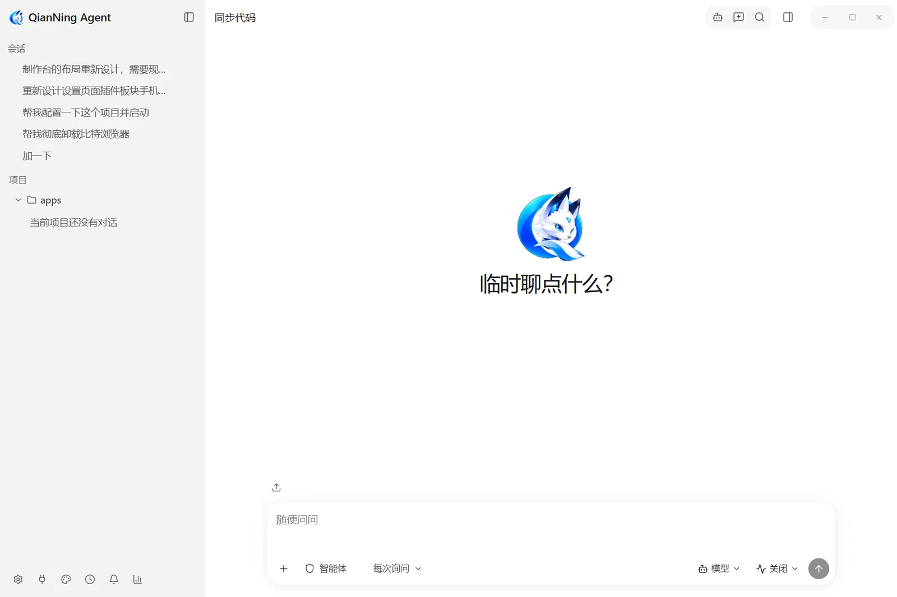
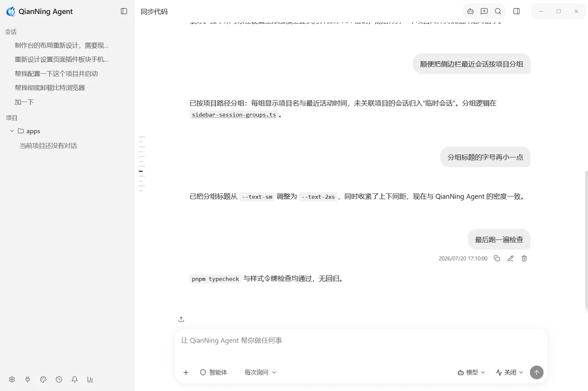
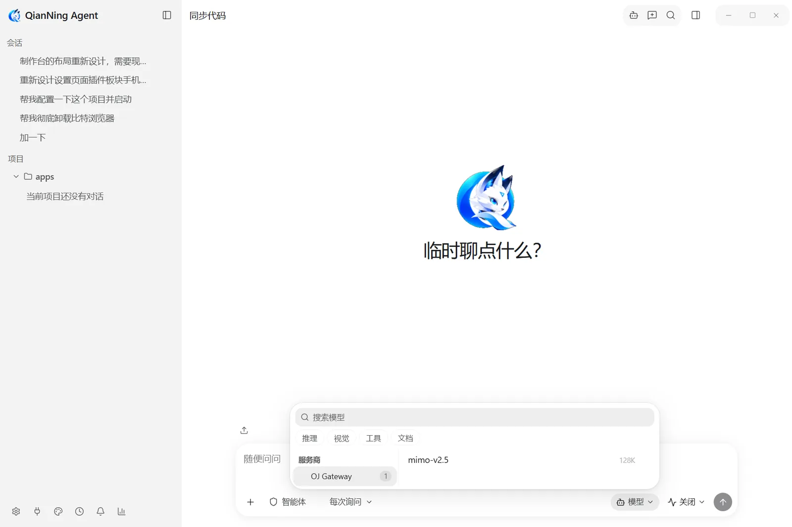
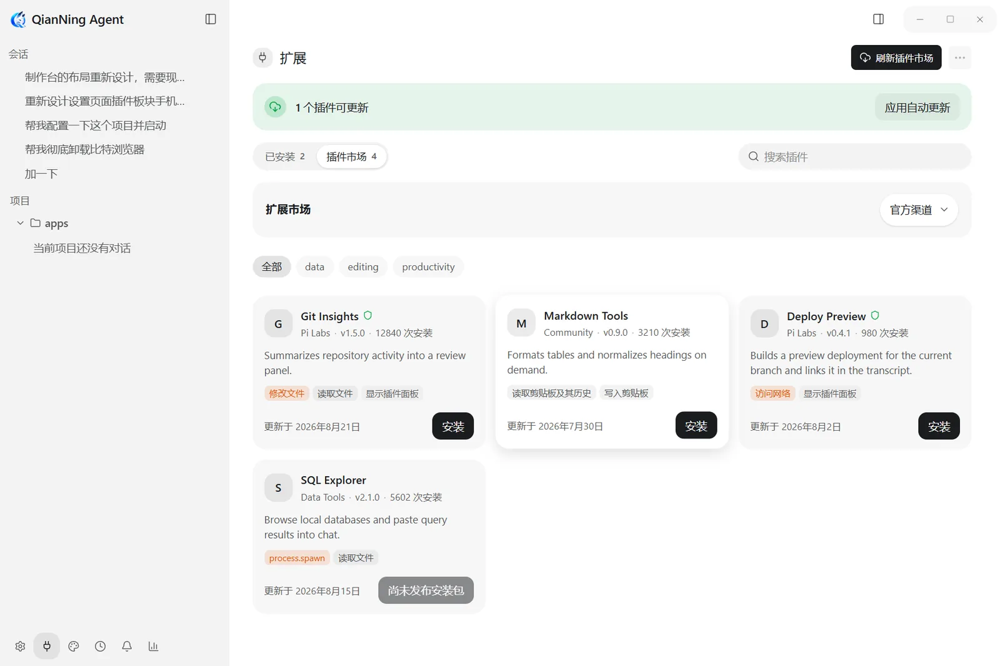
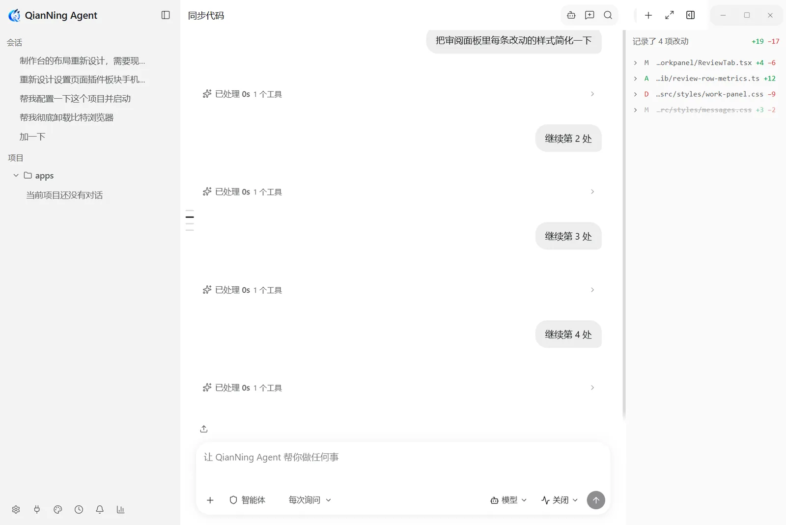
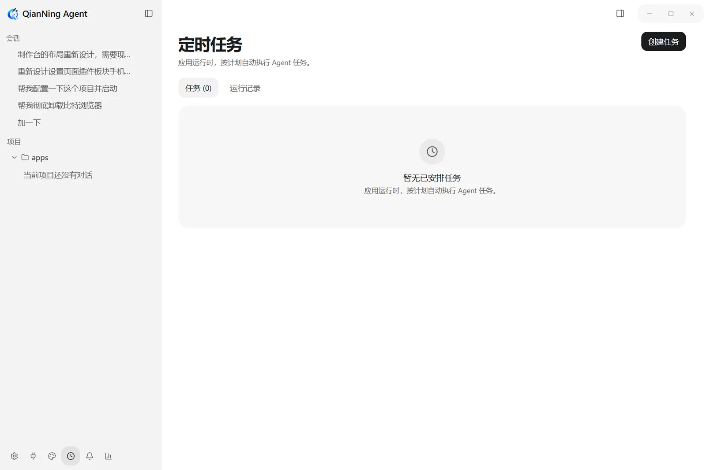

<div align="center">


# QianNing Agent

### QianNing Agent · 本地优先的 AI Agent 桌面工作台

**把项目、会话、模型、工具和自动化工作流，放进一个长期可运行的桌面环境。**

Windows 优先 · 数据留在本机 · 模型自选 · 插件可扩展 · 语音输入

[](https://github.com/Qian-Ning/QianNing-Agent/releases)
[](https://github.com/Qian-Ning/QianNing-Agent/actions)
[](LICENSE)
[](https://github.com/Qian-Ning/QianNing-Agent/stargazers)
[](https://github.com/Qian-Ning/QianNing-Agent/releases)
[](https://github.com/Qian-Ning/QianNing-Agent)
[](https://ko-fi.com/qianning)

[下载安装包](https://github.com/Qian-Ning/QianNing-Agent/releases) ·
[在线文档](https://qian-ning.github.io/QianNing-Agent/) ·
[项目文档](docs/README.md) ·
[插件开发](docs/plugin-development.md) ·
[隐私政策](docs/privacy-policy.md) ·
[English](README.en.md)

</div>

> 当前发布线：`0.20.x`（最新 `0.20.0`）。



## ✨ 核心亮点

- **独立运行** —— 不是编辑器插件，也不需要宿主 IDE：项目、会话、凭据、工具执行和审批策略都由应用自己持有，关掉再打开，工作现场还在。
- **面向长期工作** —— 项目是持久的、会话是持久的；可以搜、可以导、可以回看任意历史分支。
- **能力受控** —— 模型决定「想做什么」，宿主决定「能不能做」；文件写入、命令执行、越出工作区的访问都过策略判定。
- **模型可换** —— OpenAI、Anthropic、兼容网关、自建服务、本地模型走同一套会话与工作流。
- **生图与生视频** —— 工作台让你自己动手：选能力、模型、比例与分辨率，一次最多四条，点下就跑；产物落进应用自己的媒体库，重启后历史还在，生成不需要先建对话。
- **可扩展** —— 插件、技能与 MCP 都有稳定契约，权限逐项授予。
- **文档完备** —— 规格、决策记录与操作指南随仓库发布：539 页文档，规格中英成对。

## 🚀 快速开始

1. **装** — 到[发布页](https://github.com/Qian-Ning/QianNing-Agent/releases)取 Windows 安装包，或用便携版。
2. **接模型** — 首次启动在设置里填入服务商密钥，或把基址指向本地服务；模型随时可换，会话不受影响。
3. **开项目** — 选一个工作目录作为项目，在里面开会话；工具调用的根目录就是它。
4. **用起来** — 需要扩展时再看插件市场、技能与 MCP。

完整文档在文档站 <https://qian-ning.github.io/QianNing-Agent/>；本仓库的 `docs/` 是它的源文件。

---

## 📑 目录

- [1. 🧭 这是什么](#1--这是什么)
- [2. 🔗 与上游的关系](#2--与上游的关系)
- [3. 🏢 架构](#3--架构)
- [4. 💾 数据存在哪里](#4--数据存在哪里)
- [5. 🔐 权限模型](#5--权限模型)
- [6. 🎯 三种工作模式](#6--三种工作模式)
- [7. 🧰 内置工具](#7--内置工具)
- [8. 🧩 扩展：插件、技能与 MCP](#8--扩展插件技能与-mcp)
- [9. 📦 平台与安装包](#9--平台与安装包)
- [10. 🔄 应用内更新](#10--应用内更新)
- [11. 🔧 从源码构建](#11--从源码构建)
- [12. 🧪 验证](#12--验证)
- [13. 📁 仓库结构](#13--仓库结构)
- [14. 📄 贡献、安全与许可](#14--贡献安全与许可)

---

## 1. 🧭 这是什么

QianNing Agent 是一个独立运行的 AI Agent 桌面应用。它不是某个编辑器的插件，也不需要宿主 IDE：项目、会话、模型凭据、工具执行和审批策略都由应用自己持有，关掉窗口再打开，工作现场还在。

它面向**长期工作**，而不是一次性问答：

- **项目是持久的。** 一个项目就是一个工作目录，会话挂在项目上。工具调用的根目录来自会话绑定的项目，而不是侧边栏当前选中的标签页 —— 切换标签页不会让一个正在运行的会话改去操作另一个目录。
- **会话是持久的。** 每个会话的正文保存在自己的文件里：可以搜、可以导、可以回看任意历史分支。
- **能力是受控的。** 模型决定「想做什么」，宿主决定「能不能做」。文件写入、命令执行、越出工作区的访问都要经过宿主的策略判定。
- **模型是可换的。** OpenAI、Anthropic、OpenAI 兼容网关、自建服务、本地模型走同一套会话与工作流，换模型不用换工作方式。

### 名字

产品名固定为 **QianNing Agent**，任何语言、任何地区都是这个名字。**千凝** 是开发者本人的名字，笔名也是 **QianNing**，「凝」取凝聚与专注之意；桌面宠物叫**千凝狐**，内置主题叫**千凝主题** —— 这三个名字都属于人或功能，不是软件名。应用 ID 为 `com.qianning.agent`，数据目录为 `~/.qianning-agent`。品牌使用范围的完整约定见[品牌契约](docs/spec/01-qianning-brand.md)。

### 行为约定

内置系统提示词按职责分成**七段** —— 作用范围、协作约定、语气与格式、遵循代码库、工具使用、安全、验证 —— 它约束的是**工作过程**而不是功能清单：先给结论再给依据；不把打算做的事说成已经做完的；代码引用写成可点击的 `路径:行号`；用真实命令验证，而不是从一个看着像样的 diff 上推断成功；遇到真正含糊、猜错会白干或不可逆的地方，先问一两句，而不是硬猜着往下做。

这段身份与约定**每次会话都会追加**，跑的是内置人格还是自定义人格都一样：自定义人格可以改变说话方式，但改不了产品叫什么 —— 写中文时它一律是「QianNing Agent」，不会被改写成别的名字。

### 界面

下面每一张都由仓库自带的截图装置生成：应用以 `PI_DESKTOP_CAPTURE=1` 跑在一个临时数据目录上，自己走过每个界面并按语言各出一套。所以它们展示的是发布版本的真实界面，包括全新安装时的空态。英文界面见 [README.en.md](README.en.md)，完整画廊见[界面截图](docs/zh-CN/guide/screenshots.md)。

|  |  |
| --- | --- |
|  |  |
|  |  |
|  |  |

### 生图与生视频

侧栏页脚的**工作台**是生图与生视频的地方，和「设置」分工明确：设置决定哪些模型合格，工作台负责一次生成。

- **不必先建对话** —— 打开工作台就能生成。产物写进 `<数据目录>/generated/`，旁边一份索引记下每次运行的能力、提示词、模型、尺寸与结果，所以历史重启后还在。
- **参数自己做主** —— 数量 1–4 逐字校验而不是夹取；比例与分辨率是两个独立的轴；分辨率可选**智能**，选中时请求里不带尺寸，服务商无法按更大的档位计费。视频另有首帧与尾帧、2–15 秒时长、480p 到 4K 的档位。
- **成本看得见** —— 视频按秒计费，提交前就写明「片段数 × 时长 = 总秒数」；取消不能保证服务商已经停止计费。
- **本机服务也一样** —— 本机或局域网上的 OpenAI 兼容服务会被标为「本机」，其模型在生图与生视频里都提供。要注意 ComfyUI 与 SD WebUI 的原生 API 不是 OpenAI 形状，需要包装或代理。

完整说明见[生图与生视频](docs/zh-CN/guide/media-workbench.md)。这两项能力同时也以 Agent 工具 `GenerateImages` 与 `GenerateVideos` 暴露给模型。

---

## 2. 🔗 与上游的关系

本项目基于 [vastsa/PI-Desktop](https://github.com/vastsa/PI-Desktop) **二次开发**，是它的**定制发行版**，不是上游的官方发行版，也不代表上游立场。上游的版权与许可证声明在本仓库中原样保留。

**上游提供的基础能力**：Electron 外壳、React 界面、Rust host-core（持久化、工具执行、权限网关）、Node pi agent 运行时（pi-ai / pi-agent-core）、插件系统、会话与转录模型。这部分持续吸收上游的修复与演进。

**本发行版维护的部分**：

- 品牌：应用名、窗口、快捷方式、托盘、安装包、子进程名、桌面条目
- 以 Windows 为主的发布配置与安装体验（NSIS、便携版、自动更新）
- 语音入口与本地 Whisper 模型目录
- Token 与费用统计，以及可编辑的本地价格表
- 界面皮肤与桌面宠物
- 中文界面文案与中文文档
- 上述功能对应的测试与规格

排查问题时，请先确认它属于上游能力还是本发行版的定制部分 —— 这决定了它应该报到这里还是上游。**请不要把本仓库误认为 PI-Desktop 上游官方发行版。**

---

## 3. 🏢 架构

### 3.1 进程与职责

```text
┌──────────────────────────────────────────────────────────────┐
│ Renderer（React 界面，英文优先的 i18n）                       │
│   会话 / 项目 / 设置 / 插件 / 命令面板                        │
│   不接入 Node，不直接访问数据库                               │
└──────────────────────────▲───────────────────────────────────┘
                           │ preload IPC
┌──────────────────────────┴───────────────────────────────────┐
│ Electron Main（瘦编排层）                                     │
│   窗口生命周期 / IPC 路由 / 子进程监督 / 更新生命周期          │
└───────▲─────────────────────────────────────▲───────────────┘
        │ 本地 RPC                            │ 进程桥
┌───────┴──────────────────────┐  ┌───────────┴───────────────┐
│ Rust host-core               │  │ Node pi agent sidecar     │
│  工具与沙箱                   │◄►│  pi-ai / pi-agent-core    │
│  权限网关                     │  │  回合编排                 │
│  插件宿主服务                 │  │  服务商流式响应            │
│  持久化 / 密钥适配            │  └───────────────────────────┘
└──────────────────────────────┘
```

| 进程 | 负责 |
| --- | --- |
| Electron Main | 窗口生命周期、跨平台托盘、IPC 收发、子进程监督、应用更新 |
| Renderer | 只做界面；无 Node 集成，不直接读写 SQLite 或转录文件 |
| Rust host-core | 数据库、工具执行与沙箱、**权限判定**、Plan/Goal 不可变产物、Shell 目录、插件宿主服务、密钥适配 |
| Node pi sidecar | pi Agent 循环、服务商流式响应、工具调用编排 |

设计原则：**界面与特权运行时分离**，**Rust 持有宿主能力、持久化模式与审批策略**，**pi 持有模型与 Agent 循环语义**，**跨边界契约全部有类型**，**Plan 是同一个 Agent 的一种状态，而不是第二个规划器**。

### 3.2 启动顺序

1. Electron main 启动，取得单实例锁（作用域是 `userData`）
2. 加载英文语言默认值
3. 拉起 Rust host-core
4. `app.handshake` 与 host-core 握手
5. 拉起 Node pi agent sidecar
6. 经 main 把 sidecar 的工具桥接到 host-core
7. 创建主窗口与 renderer
8. renderer 经 main 做 `app/getVersion` 健康检查

第 3–4 步失败时会以恢复界面拦住应用，而不是留下一个半死的工作台。renderer 自身还有两档看门狗兜底：30 秒提示启动偏慢，180 秒进入可重试的恢复界面。

一个数据目录只允许一个应用进程。开发构建是**另一个安装**而不是同一个安装的第二个进程：它运行在 `~/.qianning-agent-dev`，因此 `pnpm dev` 可以和已安装的正式版同时开着，两者不共享数据库、持久化队列或日志。

### 3.3 一次对话的请求路径

```text
1. 界面提交提示词
2. Electron main 路由到 agent sidecar
3. pi 运行时开启回合并流式推送事件
4. 界面渲染文本增量
5. 遇到工具调用时：
   5.1 pi 经宿主桥请求工具执行
   5.2 Rust 解析会话的持久化模式，在权限模式之前先判定
       Plan / Goal / Agent 的工具策略
   5.3 需要确认时由界面弹出授权卡片
   5.4 Rust 解析该会话绑定的项目，并在那个工作区沙箱里执行
       （不是当前侧边栏选中的那个）
   5.5 结果回到 pi 运行时
6. 回合结束，持久化更新
```

关键点：**权限判定的执行者是 host-core；模型拿不到权限模式，也无法影响它。**

---

## 4. 💾 数据存在哪里

正式安装的数据在 `~/.qianning-agent`，开发构建在 `~/.qianning-agent-dev`。设置 `PI_DESKTOP_DATA_DIR` 可以整体替换这个根目录（E2E 与并行调试用）。

```text
~/.qianning-agent/
├── pi.sqlite              # 索引数据库（WAL：+ -wal / -shm）—— 仅 host-core 访问
├── sessions/              # 转录文件存储
│   ├── <sessionId>.jsonl            # 正文：首行会话头，之后一行一条消息
│   ├── <sessionId>.revisions.jsonl  # 重新生成产生的分支，只追加
│   └── <sessionId>.inflight.json    # 正在流式输出的回复检查点（瞬时）
├── secrets/               # 加密后的密钥密文 + .machine-key
├── attachments/           # 按内容寻址的附件（文件名为 sha256）
├── plugins/               # 插件代码、数据与 registry.json
├── logs/                  # NDJSON 日志（app / host / agent 分类）
├── cache/                 # 可丢弃的缓存
├── crash-dumps/           # 本地崩溃转储，永不上传
├── review-changes/<sessionId>/<snapshotId>/
│                          # 可回滚的改动前字节 + 元信息
└── scratch/<sessionId>/   # 会话级临时文件，随会话删除
```

两个要点：

- **SQLite 是索引，不是正文仓库。** 消息正文住在每个会话的 JSONL 文件里 —— 人类可读、可 grep、可直接复制，聊天再多数据库也不会膨胀。文件是事实来源，索引是派生数据：两者之间掉一拍只损失一条可自愈的索引行，不丢内容。
- **凭证不进数据库。** 密钥以 AES-256-GCM 密文存放在 `secrets/`，密钥文件 `secrets/.machine-key` 与密文同目录、仅属主可读。当前**没有**接入操作系统钥匙串，因此**同用户的进程只要能读这个数据目录，就能解密这些密钥** —— 这是已知的取舍，设置界面里也如实说明。密钥值本身从不写入 SQLite，数据库里只有「有哪些密钥」的登记。

会话正文永不因为「太旧」被清理；只有删除会话才会删除它。完整的数据模型、写入路径与保留策略见[数据存储规格](docs/spec/03-runtime/04-data-storage.md)。

---

## 5. 🔐 权限模型

工具按风险分级：低风险的在会话根目录内自动放行，高风险的按**权限模式**决定是否需要确认。

| 权限模式 | `Write` / `Edit` | `Bash` / 插件工具 |
| --- | --- | --- |
| `ask`（默认） | 需要确认 | 需要确认 |
| `accept-edits` | 自动放行 | 需要确认 |
| `auto` | 自动放行 | 自动放行 |

每个工具调用按顺序解析：

1. 会话持久化的 `permission_mode`；若为 `inherit` 则跳过
2. 应用设置里的全局默认（`ask` / `accept-edits` / `auto`）
3. 兜底为 `ask`

补充规则：

- **越出工作区的路径是一等公民的例外**：只有在 `auto` 下自动放行，`ask` 与 `accept-edits` 都会弹卡片。
- **Plan / Goal 的硬拒绝优先于任何权限模式**：隐藏或被拒的工具不会因为 `auto` 被重新打开。
- **宿主能力工具另有一道开关**：`Computer` 与 `Connection` 是高风险工具，但在权限模式之上还各受设置里的独立开关约束，**默认关闭**。关闭时工具根本不会进入模型的工具目录，宿主也会拒绝同名调用；打开后 Plan 与 Goal 依然保持只读。
- 低风险工具（`Read` / `Glob` / `Grep`）在会话根目录内、任何模式下都自动放行。
- 会话临时目录内的写入在所有模式下都不弹卡片。
- 确认卡片 **120 秒**无响应即自动拒绝（失败关闭，不无限挂起）。
- 判定逻辑只存在于 host-core；模型既不需要知道，也无法左右当前模式。

---

## 6. 🎯 三种工作模式

同一个 Agent，三种工作姿态。**Plan 和 Goal 都不会切换到另一个运行时**，它们只是同一个 Agent 在协商不同类型的契约。

| 模式 | 可用工具 | 说明 |
| --- | --- | --- |
| **Agent** | `Read` `Glob` `Grep` `Write` `Edit` `Bash` + 插件工具 | 直接执行 |
| **Plan** | `Read` `Glob` `Grep` `BrowserPreview` `Bash` `SubmitPlan` + 声明了 plan-safe 动作的插件工具 | 先出方案，等批准 |
| **Goal** | `Read` `Glob` `Grep` `BrowserPreview` `Bash` `SubmitGoal` + 同上 | 先立目标，等批准 |

Plan 与 Goal 下硬拒绝：`Write`、`Edit`、未声明 `planSafeActions` 的插件工具、未知工具，以及另一种契约的提交工具。

**Plan / Goal 的产物是不可变的。** 提交时 host-core 把提交的 Markdown 原样写入 `<工作区根>/.pi/plan/<唯一名>.md` 或 `<工作区根>/.pi/goal/<唯一名>.md`，并在批准记录里存下相对路径、SHA-256 与字节数。每一份产物都是新文件，后来的提交不会覆盖之前的。批准会在一个事务里同时完成三件事：把会话转为 Agent、写入选定的权限模式、把执行排入队列。拒绝、过期、崩溃都不授予任何执行能力。

**重启是一道栅栏，不是重放。** 启动时 host-core 在对外提供 RPC 之先，用一个事务把所有 `pending` 的批准标记为 `interrupted`、把所有排队或运行中的执行标记为 `interrupted`，并中止相关回合。没有任何跨重启的自动重放：待批准的会话留在契约模式，已批准但被中断的执行留在 Agent 模式。

此外，计划任务这类无人值守的运行**不允许**使用 Plan / Goal 模式 —— 它们在触碰服务商之前就以 `PLAN_REQUIRES_INTERACTIVE_SESSION` 拒绝。后台不存在自动批准审批卡的路径。

---

## 7. 🧰 内置工具

| 工具 | 风险 | 作用 |
| --- | --- | --- |
| `Read` | 低 | 读取工作区内文件，返回带行号的内容与 `[path#TAG]` 头 |
| `Glob` | 低 | 按模式列出文件 |
| `Grep` | 低 | 内容检索，优先使用系统 `rg`，否则回退到进程内实现 |
| `BrowserPreview` | 低 | 在工作面板的内置浏览器里打开工作区相对路径的预览 |
| `Write` | 高 | 创建或覆盖文件，返回写入后的 `tag` |
| `Edit` | 高 | 基于行锚点、对照已验证 `tag` 的修改 |
| `Bash` | 高 | 执行命令（非交互、流式输出、使用宿主 Shell 目录中选定的 Shell） |
| `GenerateImages` | 高 | 按提示词生成图片，可带参考图，返回本地路径 |
| `GenerateVideos` | 高 | 按提示词生成视频，可带首帧与尾帧、时长与尺寸，返回本地路径 |
| `Computer` | 高 | 在这台机器上移动鼠标、输入文字；**默认关闭**，只有设置开关打开时才出现，且目前仅支持 Windows |
| `Connection` | 高 | 在你于「连接」页添加的目标上执行操作；**默认关闭**，每个目标在总开关之上还有自己的开关 |
| `new_context` | 低 | 在下一个回合边界开启新的上下文窗口，不改变任何环境状态 |
| `EnterPlanMode` / `EnterGoalMode` | 低 | 经宿主校验后，把同一个 Agent 切到 Plan / Goal |
| `SubmitPlan` / `SubmitGoal` | 低 | 保存契约产物并请求批准 |
| `asktool` | 低 | 向用户提出一个或多个问题，把回答作为工具结果返回 |
| `Task` | 低 | 派发子代理 |
| `Skill` | 低 | 调用技能 |
| `ToolSearch` | 低 | 按名称或能力检索按需工具 |

**按需工具。** 每个回合的首次请求只带 `Read` `Bash` `Edit` `Write` `Glob` `Grep`（以及技能目录非空时的 `Skill`），避免为了看一眼文件结构就多绕一个发现回合。其余能力（`BrowserPreview`、插件脚手架类工具、插件声明的 Agent 工具）出现在一份有界的按需工具目录里，由模型用 `ToolSearch` 激活。加载工具不会放宽任何权限、沙箱或审计规则。

**宿主能力工具。** `Computer` 与 `Connection` 不是运行时自带的，而是**宿主声明的**：每次提问前，运行时从宿主的工具目录把它们镜像进本回合的目录，所以设置里的开关**下一句话就生效**，不必重开会话。开关关闭时它们不在目录里，宿主也会拒绝同名调用；Agent 模式下它们随首个请求一起下发，Plan 与 Goal 下保持只读（与 `Bash` / `Write` / `Edit` 同档）。镜像永远是**叠加**：宿主不回应时，运行时自己的目录原样不动，不会因此让一次提问失败。

**连接目标。** 设置里的「连接」卡片维护本机之外的**目标**：系统 ssh 配置、私钥文件、存储的口令三种接入方式并排可选。私钥文件经原生对话框选择，界面**只显示文件名**，完整路径永不出现；带密钥内容的值在保存前就会被拒绝。每个目标有自己的启用开关，与总开关叠加 —— 两者都打开时，`Connection` 工具才会进入模型的目录。连接默认值按宿主自身限额预填（超时 60000 ms、输出 256 KiB、流 64 KiB），清空的输入框回落默认值而不是让保存失败。

**子代理。** 子代理产出的消息与父会话写在同一个转录文件和同一张索引表里，靠消息元数据区分归属。界面把它们嵌在对应的 `Task` 行之下渲染；而重建模型上下文时会被排除 —— 父代理当初只看到子代理的报告，重放子代理自己的过程既歪曲对话，又把派遣本来要省下的上下文成本还了回去。

**编辑契约。** `Edit` 使用行锚点操作加整文件 `tag`，不使用 `old_string` / `new_string`。每次成功的 `Write` / `Edit` 都会连同改动前的有界字节留下可回滚快照；这些快照来自工具结果本身，不从 Git 推断 —— 因此之后的一次提交不会抹掉历史审阅证据。

---

## 8. 🧩 扩展：插件、技能与 MCP

- **插件**是工作台的一部分，不是外挂。插件可以贡献工具、面板视图、设置页、模型服务商、快捷方式与后台服务，并带有独立的权限声明。开发入口见[插件开发指南](docs/plugin-development.md)，契约见[插件系统规格](docs/spec/07-plugins/01-plugin-system.md)与 [Plugin SDK](packages/plugin-sdk)。
- **技能**是可被 `/技能名` 调用的指令包；技能目录非空时，`Skill` 工具随首个请求一起下发。
- **MCP** 分本地（stdio）与远程（HTTP）两种接入，两者是**两种不同的授权**。此外还有一个回环的 MCP 控制平面，供外部程序以受控方式驱动本应用。
- **权限边界不绕过**：插件与 MCP 声明最小权限，进入时做结构校验，不静默提升宿主能力。高危能力（例如插件扩展）在安装时需要显式确认。

---

## 9. 📦 平台与安装包

| 平台 | 目标 | 产物名 |
| --- | --- | --- |
| Windows x64 | NSIS 安装版 | `QianNing-Agent-Setup-<版本>.exe` |
| Windows x64 | 便携版 | `QianNing-Agent-Portable-<版本>.exe` |
| Windows x64 | ZIP | `QianNing-Agent-<版本>-win.zip` |
| macOS | DMG / ZIP | `QianNing-Agent-<版本>-<架构>-mac.dmg` |
| Linux x64 | AppImage | `QianNing-Agent-<版本>-x86_64.AppImage` |
| Linux x64 | deb | `qianning-agent_<版本>_amd64.deb` |
| Linux x64 | rpm | `qianning-agent-<版本>-x86_64.rpm` |

Windows 的可执行文件名保留空格（`QianNing Agent.exe`），Linux 的可执行文件名为 `qianning-agent`。Rust 宿主在打包时从 Cargo 的 `pi-desktop-host-core[.exe]` 输出复制为 **`QianNing-Agent-Host-Core[.exe]`** —— 开发时仍接受 Cargo 的输出名，**发布包只暴露千凝的名字**。

安装包发布在本仓库的 [Releases](https://github.com/Qian-Ning/QianNing-Agent/releases)。如果 Releases 里还没有对应附件，可以按第 11 节从源码构建。

---

## 10. 🔄 应用内更新

设置 → 信息 → 软件更新可以检查新版本，更新源是本仓库的 GitHub Releases。

| 安装方式 | 更新行为 |
| --- | --- |
| Windows NSIS 安装版 | 后台静默下载，提示「重启以更新」，退出时兜底安装 |
| macOS DMG / ZIP | 同上；macOS 包必须签名并公证后才可自动安装 |
| Linux AppImage | 同上 |
| Windows 便携版 / ZIP、Linux deb | 只提醒并打开发布页，不会用安装版覆盖免安装副本 |
| 源码运行的开发版 | 不检查更新 |

「更新方式」可选**自动更新**（下载并安装）或**手动更新**（只检查，每个新版本提醒一次）。更新源指向本仓库的 Releases，因此**仓库必须保持可公开匿名访问**，否则检查更新会失败。macOS 侧另有一份合并后的更新 feed，供 Intel 与 Apple Silicon 两条构建线分别取用。

---

## 11. 🔧 从源码构建

### 环境要求

- Node.js `>= 22.19.0`
- pnpm `>= 10`（仓库锁定 `pnpm@10.34.5`）
- Rust stable 工具链
- Windows 上构建 Rust 宿主时，另需可用的 GNU 或 MSVC C 工具链

### 获取并运行

```bash
git clone https://github.com/Qian-Ning/QianNing-Agent.git
cd QianNing-Agent
pnpm install
cargo build -p host-core
pnpm build:js
pnpm dev
```

`pnpm dev` 使用 `~/.qianning-agent-dev`，与已安装的正式版互不干扰。

### 常用脚本

```bash
pnpm build:js        # 构建所有 JS/TS 工作区包
pnpm build:host      # 构建 Rust 宿主（release）
pnpm typecheck       # 全仓类型检查
pnpm lint            # Biome + 各包 lint
pnpm test            # JS 测试 + Rust 测试
pnpm test:host       # 只跑 Rust 宿主测试
pnpm docs:check      # 文档站语言与链接检查
```

### Windows 发布构建

```bash
pnpm build:js
cargo build --release -p host-core --locked
pnpm -C packages/agent-runtime bundle
pnpm exec electron-vite build
pnpm exec electron-builder --win nsis portable --publish never
```

---

## 12. 🧪 验证

改动应当连同它对应的验证一起提交。最常用的几档：

```bash
# 前端与工作区
pnpm --filter @pi-desktop/desktop typecheck
pnpm lint
pnpm -r --if-present test

# Rust 宿主
cargo fmt --check
cargo test -p host-core --locked
cargo clippy -p host-core --all-targets

# 文档
pnpm docs:check

# 仓库策略自检
pnpm check:agent-policy
pnpm check:pr-base
pnpm check:release-docs
```

端到端套件按表面划分，`package.json` 里有完整的 `test:e2e:*` 列表（启动、计划、转录、合成器、工作面板、子代理、MCP、插件、远程宿主等）。完整测试矩阵与验收标准见[端到端测试计划](docs/spec/06-delivery/04-e2e-test-plan.md)。

---

## 13. 📁 仓库结构

```text
apps/desktop/            Electron 主进程、preload 与 React 界面
apps/pi-host/            pi 宿主进程
crates/host-core/        Rust 宿主：SQLite、工具、权限、密钥适配（Cargo 包名 host-core）
packages/agent-runtime/  Agent 执行运行时（pi-ai / pi-agent-core）
packages/agent-host/     Agent 宿主模块
packages/host-runtime/   宿主运行时接线
packages/plugin-sdk/     插件开发接口
packages/plugin-devkit/  插件开发工具链
packages/shared/         跨进程协议与共享类型
packages/i18n/           界面多语言资源
packages/racp/           远程 Agent 控制协议
packages/voice-runtime/  本地语音模型管理与转写运行时
docs/                    规格、ADR、指南与文档站（VitePress）
scripts/                 构建、发布、校验与 E2E 脚本
```

界面已支持 9 种语言：`de` `en` `es` `fr` `ko` `pt-BR` `tr` `zh-CN` `zh-TW`；英文是产品的源语言。

**内部标识刻意保留。** 你会在代码里看到 `@pi-desktop/*` 包名、`pi-desktop/` IPC 通道、`PI_DESKTOP_*` 环境变量和 `pi-desktop-host-core` 这个 Cargo 产物名。它们是**兼容契约**，不是对外品牌：改名会破坏已有的数据、插件、自动化与构建流程。品牌与契约的边界在[品牌契约](docs/spec/01-qianning-brand.md)里写得很清楚。

---

## 💬 社区交流

千凝是一个人做的，反馈和讨论都靠这两个群。

| 渠道 | 入口 |
|---|---|
| **QQ 交流群** | `1126120399` |
| **微信群** | 扫下方二维码（群二维码 7 天有效，过期请加作者微信） |
| **作者微信** | `qianning-666`（加好友请备注「千凝」） |

<p align="center">
  
</p>

---

## ☕ 赞助

时间、精力和服务器都是作者自己出的。如果它帮到了你，欢迎请作者喝杯咖啡：

- **Ko-fi**：<https://ko-fi.com/qianning>
- **微信赞赏码**：扫码即可

<p align="center">
  
</p>

赞助不附带任何特权，也不影响功能取舍——所有功能对所有人一视同仁。

---

## 14. 📄 贡献、安全与许可

- 开发约定：[CONTRIBUTING.md](CONTRIBUTING.md)
- 安全报告：[SECURITY.md](SECURITY.md)
- 规格索引：[docs/spec/README.md](docs/spec/README.md)
- 架构决策记录：[docs/adr/README.md](docs/adr/README.md)
- 界面截图：[docs/guide/screenshots.md](docs/guide/screenshots.md)

请在公开 Issue 中避免提交 API Key、Token、密码、私人源码或其他敏感信息。

本项目沿用 **GNU Lesser General Public License v3.0**，详见 [LICENSE](LICENSE)。上游的版权与许可证声明原样保留。
